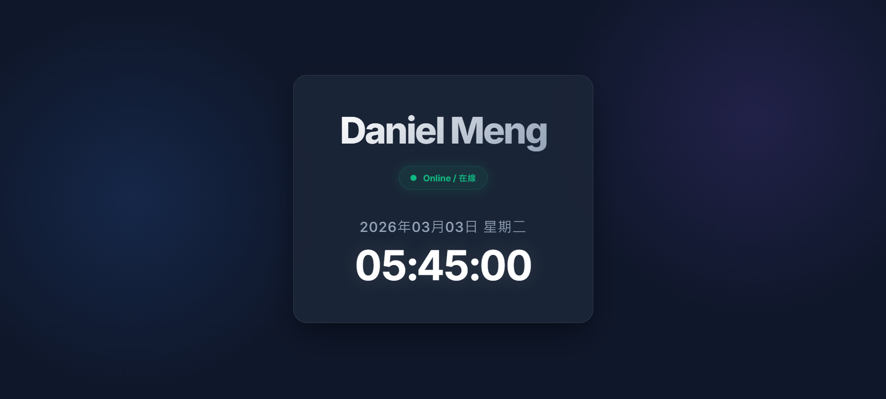

# Daniel Meng - Personal Webpage

🌍 **Live Website**: [https://mengbei0116.github.io/DeepRL-DIC_1/](https://mengbei0116.github.io/DeepRL-DIC_1/)

## 📸 網頁展示 (Screenshot)

## 📝 開發摘要 (Project Summary)

這個專案是一個以現代化設計打造的單頁個人網站，所有的結構、樣式與邏輯皆整合在一個單一的 HTML 檔案 (`index.html`) 之中。以下為開發與部署過程的整理：

### 1. 核心功能實作
- **姓名展示**：透過 CSS 漸層效果實現具有質感的 "Daniel Meng" 字體。
- **即時時鐘**：使用 JavaScript 抓取目前的本機系統時間，實作每秒自動更新即時時鐘，並顯示完整的年月日與星期。
- **在線狀態**：實作 "Online / 在線" 狀態徽章，搭配透過 `@keyframes` 定義的「脈衝呼吸燈（Pulse）」動畫效果。

### 2. 視覺與 UI 設計 (Premium Aesthetics)
- **Glassmorphism (玻璃擬態)**：以半透明模糊的卡片為主體介面，搭配光暈效果與柔和陰影。
- **動態互動**：滑鼠懸停於卡片時加入上浮動畫與發光效果，提升整體科技感與現代感。
- **Google Fonts**：匯入 `Inter` 字體，讓數字與文字的排版更為整齊與現代。
- **響應式設計 (RWD)**：考量了不同裝置的顯示比例，以提供更好的閱讀體驗。

### 3. 版本控制與部署
- 將實作完畢的 `index.html` 透過命令列工具建立本地端的 Git 儲存庫 (Repository)。
- 將資料夾連結至 GitHub 遠端儲存庫：[mengbei0116/DeepRL-DIC_1](https://github.com/mengbei0116/DeepRL-DIC_1)。
- 成功將原始碼 `push` 至 GitHub 主分支 (`main`)。
- 啟用 **GitHub Pages** 功能進行部署，達成網頁公開落地的目標。
